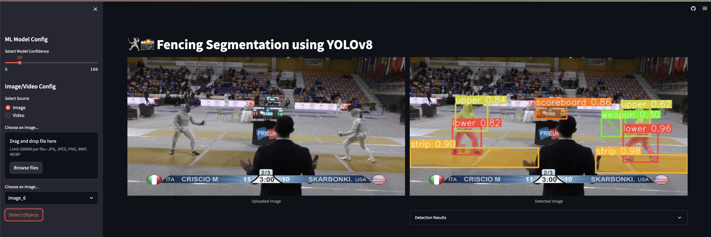

# 🤺📸 FencingVision 

## Analyzing Fencing Videos with Computer Vision


<!---
--->
Welcome to [FencingVision](https://fencing-vision.streamlit.app/), an innovative application that utilizes the power of computer vision to analyze fencing videos like never before! This README file serves as your comprehensive guide to understanding, setting up, and utilizing this exciting project.

## Table of Contents
- [Introduction](#introduction)
- [Features](#features)
- [Getting Started](#getting-started)
  - [App link](#app-links)
  - [Installation](#installation)
  - [Usage](#usage)
- [How It Works](#how-it-works)
- [Technology Stack](#technology-stack)
- [Contributing](#contributing)
- [Milestones](#milestones)
- [Contact](#contact)
- [Acknowledgement](#acknowledgement)
- [Interesting Paper](#interesting-paper)
<!---
- [License](#license)

- [Acknowledgements](#acknowledgements)
--->
## Introduction

FencingVision is an app designed to revolutionize the analysis of fencing videos using the cutting-edge capabilities of computer vision. It provides fencers, coaches, and enthusiasts with an advanced toolset to extract valuable insights from recorded fencing bouts. By harnessing the power of artificial intelligence, FencingVision aims to enhance training, improve performance, and elevate the overall understanding of the sport.

## Features

- **Instance Annotation and Tagging**: Annotate videos with labels, tags, and notes to enable easy organization, search, and retrieval of specific fencing sequences or training sessions.

- More to come!
<!---
- **Fencing Action Recognition**: Automatically detect and classify different fencing actions, such as attacks, parries, ripostes, and more, within a video sequence.

- **Fencer Performance Evaluation**: Analyze fencer technique, timing, and footwork to provide detailed performance metrics, such as accuracy, speed, reaction time, and balance.

- **Fencing Bout Summaries**: Generate concise summaries of fencing bouts, including highlights, key moments, scoring patterns, and statistical data.

- **Training Recommendations**: Based on the analysis of individual fencer performance, provide personalized training recommendations and drills to address weaknesses and improve overall skills.

- **Annotation and Tagging**: Annotate videos with labels, tags, and notes to enable easy organization, search, and retrieval of specific fencing sequences or training sessions.

- **Real-time Analysis**: Perform live analysis of fencing bouts by connecting a video feed directly to FencingVision, allowing instant feedback and evaluation.
--->
## Getting Started

### App links

Current app version can be accessed with this [link](https://fencing-vision.streamlit.app/).

### Installation

To set up FencingVision on your local machine, follow these steps:

1. Clone the FencingVision repository from GitHub:
```
git clone https://github.com/Ph1n-Pham/fencing-vision.git
```

2. Install the required dependencies using pip:
```
pip install -r requirements.txt
```
<!---
3. Download the pre-trained models and weights necessary for running FencingVision. You can find the download link in the `weights/best.pt` file.
--->
### Usage

Once you have completed the installation process, you can start using FencingVision. Follow these steps:

1. Launch the FencingVision app:
```
streamlit run app.py
```

2. Upload a fencing video for analysis. Supported formats include MP4, AVI, and MOV.

3. Wait for the analysis to complete. The duration depends on the length and complexity of the video.

4. Explore the results! View the action recognition labels, performance metrics, bout summaries, and training recommendations.

## How It Works

FencingVision employs a combination of computer vision techniques, machine learning models, and deep neural networks to analyze fencing videos. The process involves the following steps:

1. **Video Input**: FencingVision takes a recorded video of a fencing bout as input.

2. **Video Preprocessing**: The video is preprocessed to enhance quality, stabilize the frames, and reduce noise, ensuring optimal analysis conditions.

8. **Real-time Segmentation**: Using YOLOv8 (state-of-the-art computer vision model), FencingVision recognizes and classifies different body parts of fencers, allowing for video review and technique lessons.

<!---

3. **Action Recognition**: Using state-of-the-art computer vision algorithms, FencingVision recognizes and classifies various fencing actions, identifying attacks, parries, ripostes, and other essential elements of the bout.

4. **Performance Evaluation**: Based on the detected actions, FencingVision evaluates the fencer's technique, timing, and footwork, generating insightful performance metrics.

5. **Bout Summaries**: FencingVision creates concise summaries of the fencing bout, highlighting key moments, scoring patterns, and statistical data.

6. **Training Recommendations**: Leveraging the performance evaluation results, FencingVision provides personalized training recommendations and drills to help fencers improve specific aspects of their game.

7. **Annotation and Tagging**: FencingVision allows users to annotate videos with labels, tags, and notes, enabling easy organization and retrieval of specific sequences or training sessions.

8. **Real-time Analysis**: By connecting a video feed directly to FencingVision, users can perform live analysis of fencing bouts, receiving instant feedback and evaluation.
--->

## Technology Stack

FencingVision is built using the following technologies:

- Python: The core programming language for the application.
- OpenCV: Used for video processing, frame manipulation, and image enhancement.
- [YOLOv8](https://github.com/ultralytics/ultralytics): Computer Vision model used for instance segmentation tasks.
- [Roboflow](https://roboflow.com/): Efficiently label and annotate dataset.
- [Streamlit](https://github.com/streamlit/streamlit): Web App deployment.

## Contributing

We welcome contributions to make FencingVision even better! To contribute, please follow these guidelines:

1. Fork the repository on GitHub.
2. Make your changes in a new branch.
3. Ensure that your code adheres to the project's coding style and conventions.
4. Test your changes to ensure they work as expected.
5. Submit a pull request, clearly describing the changes you have made.

## Milestones

This is only the first iteration of the app! Here are some potential ideas for further development:

1. Youtube as a Video source option to conveniently search and analyze on Fencing clips from Youtube.
2. Real-time camera option.
3. Replay feature to improve Video review experience.
4. Implement Human Pose Estimation for movement analysis.

## Contact

If you have any questions, suggestions, or feedback, please feel free to reach out to me.

## Acknowledgement

- The app is hugely inspired by the work of CodingMantras from this [repo](https://github.com/CodingMantras/yolov8-streamlit-detection-tracking)
- The dataset could not be made without the support of Roboflow: Dwyer, B., Nelson, J. (2022), Solawetz, J., et. al. Roboflow (Version 1.0) [Software]. Available from https://roboflow.com
- Thank you for the support of my mentor Reza Fazeli

## Interesting paper:
- Paper ["CTVIS: Consistent Training for Online Video Instance Segmentation"](https://arxiv.org/abs/2307.12616v1?utm_source=tldrai) proposes a new technique for video segmentation
<!---
## License

FencingVision is released under the [MIT License](https://github.com/yourusername/fencing-vision/blob/main/LICENSE).


## Acknowledgements

I would like to express our gratitude to the following individuals and organizations for their contributions and support:

- The open-source community for their valuable libraries and frameworks.
- Fencing coaches and athletes for their insights and feedback during the development process.
--->
